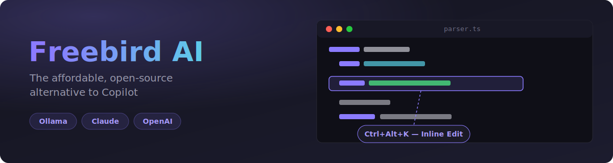
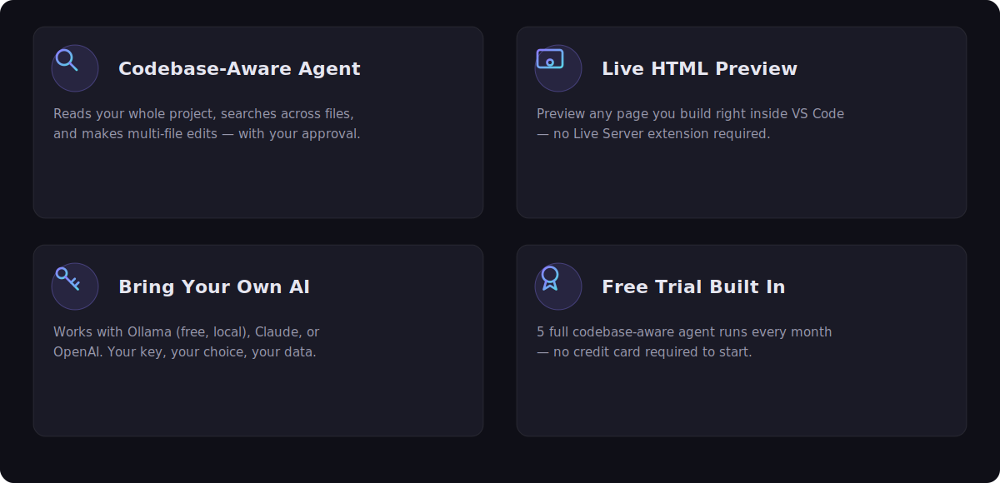

# Freebird AI — Open-Source AI Coding Assistant for VS Code

[](https://marketplace.visualstudio.com/items?itemName=TenLabs.freebird-ai)
[](https://marketplace.visualstudio.com/items?itemName=TenLabs.freebird-ai)
[](https://marketplace.visualstudio.com/items?itemName=TenLabs.freebird-ai&ssr=false#review-details)
[](https://github.com/Adilaw12/freebird-vscode/blob/main/LICENSE)
[](https://github.com/Adilaw12/freebird-vscode)

> The affordable, open-source alternative to Copilot. Reads your entire codebase, edits files, and pushes to GitHub — powered by Ollama (free/local), Claude, or OpenAI.



---

## Free vs Pro

| Feature | Free | Pro ($6/mo) |
|---|:---:|:---:|
| AI chat (unlimited questions) | ✅ | ✅ |
| Active file + `@` file context | ✅ | ✅ |
| `/` slash commands | ✅ | ✅ |
| Ollama / Claude / OpenAI backends | ✅ | ✅ |
| **Full codebase reading & indexing** | — | ✅ |
| **Multi-file editing with diffs** | — | ✅ |
| **Inline edit (`Ctrl+Alt+K`)** | — | ✅ |
| **Terminal command execution** | — | ✅ |
| **AI commit message generation** | — | ✅ |
| **Approve / reject before any change** | — | ✅ |
| **Project memory across sessions** | — | ✅ |

**Try before you buy:** free users get **5 full codebase-aware agent runs per month** (indexing, multi-file edits, inline edit) — no card required.

**[Upgrade to Pro — $6/month](https://buy.stripe.com/4gMeVf1K51ZA2604KxfAc02)**

---

## Features



### Bring Your Own AI — No Copilot Required
Works with **Ollama** (local, totally free), **Anthropic Claude** (pay-as-you-go), or **OpenAI**. Bring your own API key. No GitHub Copilot subscription needed.

### Understands Your Whole Codebase (Pro)
Freebird indexes your workspace and reads any file on demand. Ask it to refactor a module, trace a bug across files, or add a feature — it reads the relevant files first, then makes targeted edits with your approval.

### Makes Real Code Changes (Pro)
The AI creates and edits files directly in your workspace. Every write, edit, or destructive action shows an **Approve / Reject** card — nothing is modified silently.

### Inline Edit — Cursor-style (Pro)
Select any code, press `Ctrl+Alt+K`, type an instruction, and the selection is rewritten in place.

### Smart Chat (Free)
Ask anything about your code. Type `@filename` to inject any file into the conversation. Type `/` to see all available commands.

### Git Integration (Pro)
Generate commit messages, push to remote, and check git status — all from the chat panel.

### Project Memory (Pro)
Freebird can save notes about your project — conventions, decisions, in-progress work — to `.freebird/memory.md` and automatically loads them into context on future requests, so it doesn't forget what you told it last time. Use `/memory` to see what's saved and `/forget` to clear it.

---

## Getting Started

### Option 1 — Ollama (free, runs locally)

1. Install [Ollama](https://ollama.ai)
2. Pull a coding model:
   ```
   ollama pull qwen2.5-coder
   ```
3. Open Freebird AI chat (`Ctrl+Alt+O`) — works immediately, no API key needed.

### Option 2 — Anthropic Claude

1. Get an API key at [console.anthropic.com](https://console.anthropic.com)
2. Run **Freebird: Configure AI Backend** from the Command Palette
3. Select **Anthropic Claude** and paste your API key.

### Option 3 — OpenAI

1. Get an API key at [platform.openai.com](https://platform.openai.com)
2. Run **Freebird: Configure AI Backend** from the Command Palette
3. Select **OpenAI** and paste your API key.

---

## Commands

| Command | Shortcut | Description |
|---|---|---|
| Freebird: Open Chat | `Ctrl+Alt+O` | Open the AI chat panel |
| Freebird: Edit with AI | `Ctrl+Alt+K` | Inline rewrite selected code (Pro) |
| Freebird: AI Commit | — | Generate a commit message (Pro) |
| Freebird: Configure AI Backend | — | Switch between Ollama / Claude / OpenAI |
| Freebird: Activate Pro License | — | Enter your Pro license key |

### Chat Commands

| Command | Description |
|---|---|
| `/commit` | Generate a commit message (Pro) |
| `/push` | Push to remote (Pro) |
| `/status` | Show git status (Pro) |
| `/memory` | Show what Freebird remembers about this project (Pro) |
| `/forget` | Clear project memory |
| `/clear` | Clear conversation history |
| `/help` | Show all commands |

---

## How the Agent Works (Pro)

When you ask Freebird to perform a task, it runs an agent loop — similar to Cursor Composer:

1. **Reads** your workspace file tree automatically
2. **Fetches** specific files it needs
3. **Searches** the codebase for symbols, patterns, or text
4. **Edits** files with targeted diffs — Approve / Reject before anything changes
5. **Creates** new files — preview shown before creation
6. **Runs** terminal commands — shown before execution
7. **Commits and pushes** — requires your explicit approval

Nothing is modified silently. You stay in full control.

---

## Settings

| Setting | Default | Description |
|---|---|---|
| `freebird.backend` | `ollama` | AI backend: `ollama`, `anthropic`, `openai` |
| `freebird.apiKey` | *(empty)* | API key for Anthropic or OpenAI |
| `freebird.model` | *(auto)* | Override the default model |
| `freebird.ollamaUrl` | `http://localhost:11434` | Ollama server URL |
| `freebird.licenseKey` | *(empty)* | Pro license key |

**Default models:** Ollama → `qwen2.5-coder` · Anthropic → `claude-haiku-4-5` · OpenAI → `gpt-4o-mini`

**Tip:** For heavier multi-file agent tasks (Pro), set `freebird.model` to `claude-sonnet-4-6` — it follows multi-step instructions more reliably than Haiku, at a higher API cost.

---

## Privacy

- **Ollama**: all processing is local — no data leaves your machine.
- **Anthropic / OpenAI**: your code is sent to their APIs under your own account.
- **Freebird AI** (Ten Labs Pty. Limited) never collects or stores any of your code or data.

---

## Support

Having trouble with a payment, license activation, or anything else? Email **[support@ten-labs.com.au](mailto:support@ten-labs.com.au)** and we'll help you out.

---

## Contributing

Freebird AI is open source. Issues and PRs welcome at the [GitHub repository](https://github.com/Adilaw12/freebird-vscode).

---

## License

MIT — Copyright © 2025 Ten Labs Pty. Limited
